# Nexum — Research Portfolio & Accreditation Readiness System

Nexum is an institutional research activity and accreditation readiness tracking system built for higher education institutions, research labs, and academic departments. It enables continuous tracking of faculty publications, co-author management (internal faculty vs. external collaborators), evidence attachment, and institutional reporting.

---

## 📸 Screenshots Gallery

| Institutional Dashboard | Publications Directory & Filters |
| :---: | :---: |
| 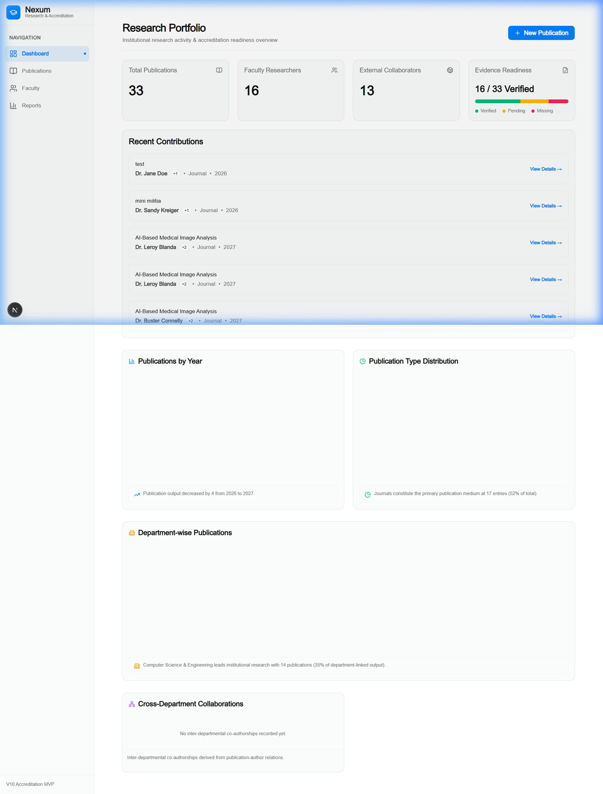 | 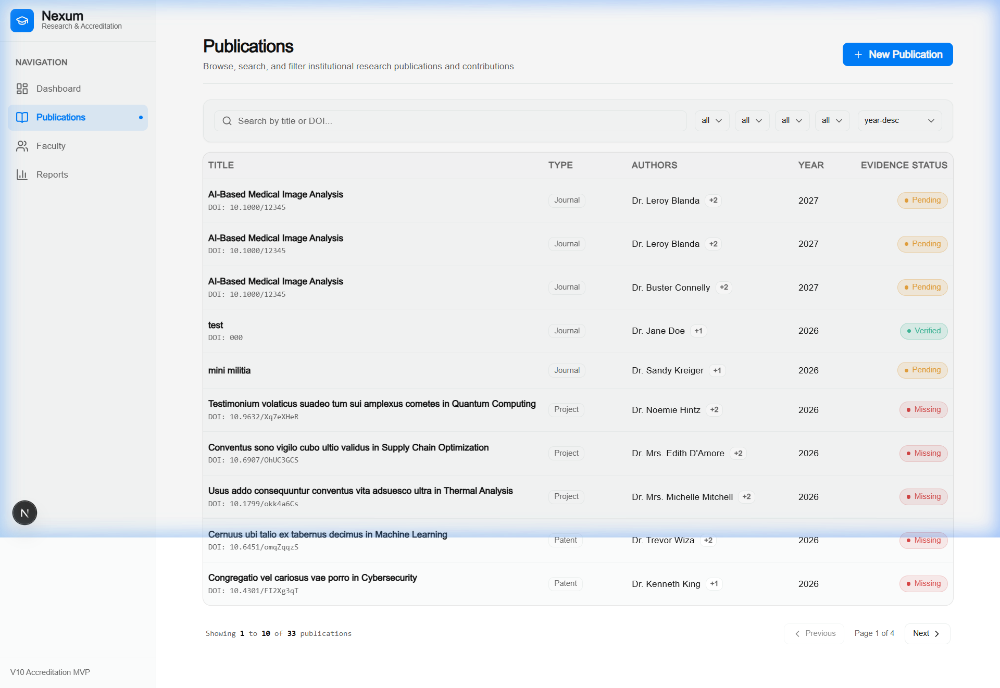 |

| 3-Step Creation Wizard | Publication Details & Cascade Delete |
| :---: | :---: |
| 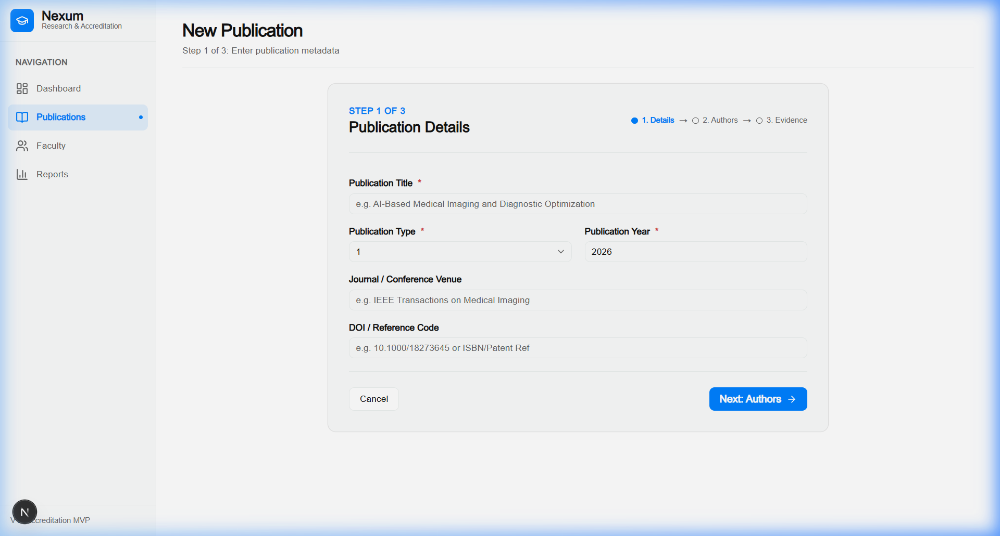 | 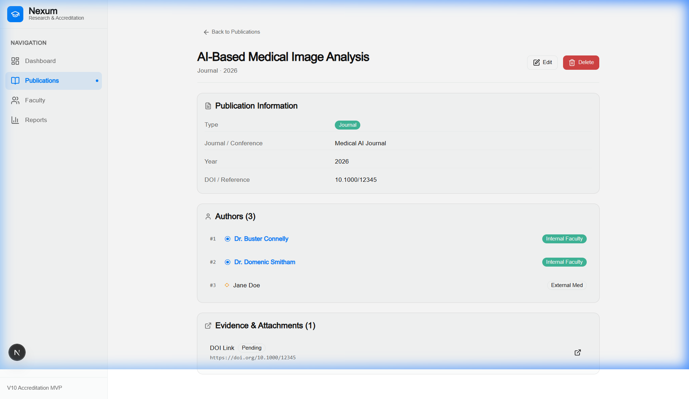 |

| Faculty Research Profile | Reports & Analytics |
| :---: | :---: |
| 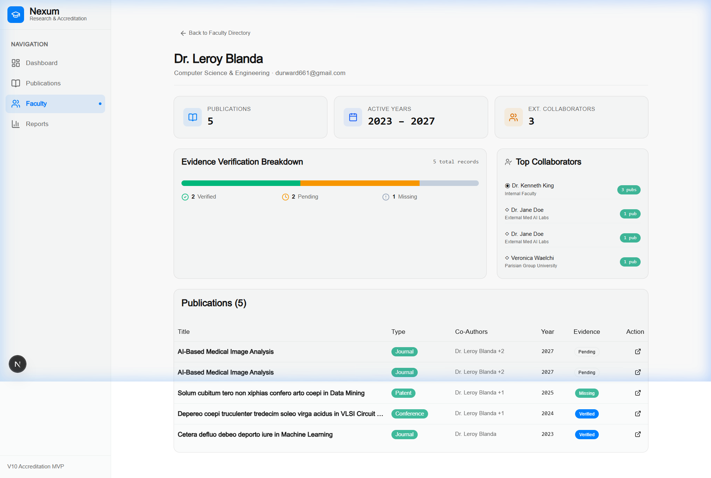 | 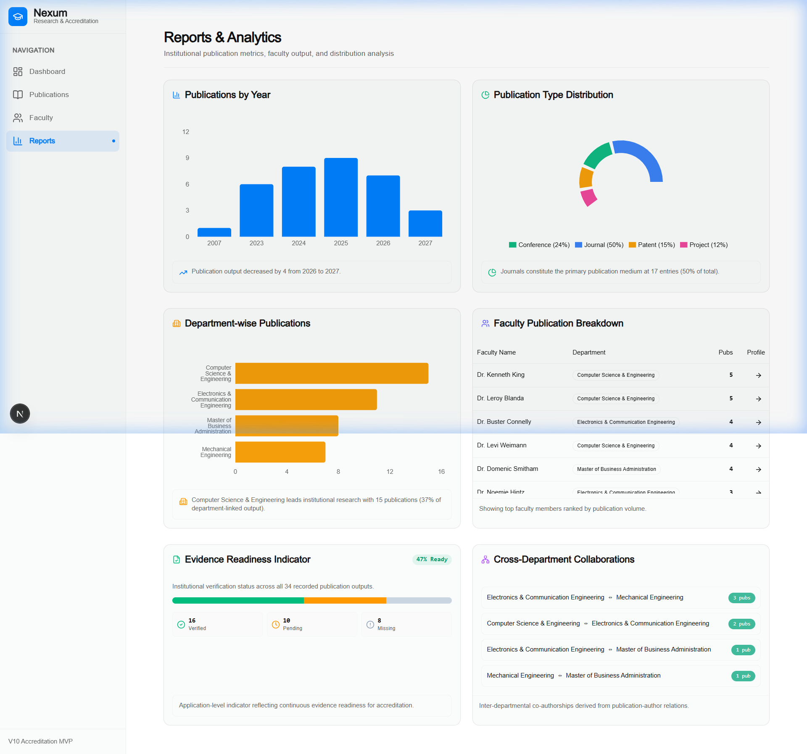 |

---

## 🚀 Key Features

1. **Institutional Research Dashboard**
   - Live KPI cards: Total Publications, Active Faculty Researchers, External Collaborators, Evidence Readiness.
   - Recent Contributions feed with author summaries.
   - Integrated analytical charts for Yearly output, Publication Types, and Department breakdowns.

2. **3-Step Publication Creation & Edit Wizard**
   - **Step 1 (Metadata)**: Title, Publication Type (Journal, Conference, Patent, etc.), Venue/Journal name, Year, DOI/Reference.
   - **Step 2 (Authors)**: Real-time faculty search popover (`⦿` glyph + department badge), inline external author creation & search (`◇` glyph + affiliation), 1-based order tracking, up/down reordering. Non-blocking validation hints for author distribution.
   - **Step 3 (Evidence)**: Reference URL/text, Evidence type, Verification status (Verified, Pending, Missing).

3. **Publications Directory with Advanced Search, Filter & Pagination**
   - Server-side text search (Title, DOI/Reference).
   - Multi-field filters (Department, Publication Type, Year, Evidence Status).
   - Column sorting (Year, Title; ASC/DESC).
   - Server-side page-based pagination preserving state in URL search params.
   - Dynamic empty states with active filter pills and clear actions.

4. **Faculty Research Profile**
   - Faculty header with department and email metadata.
   - KPI row: Total Publications, Active Years Range (min-max), External Collaborator count.
   - Segmented Evidence Readiness bar (Verified / Pending / Missing).
   - Top Collaborators section ranking co-authors by joint output count.
   - Chronological publication history.

5. **Reports & Analytics (Real Aggregate Queries)**
   - Publications by Year (Bar Chart) + dynamic trend insight line.
   - Publication Type Distribution (Donut Chart) + calculated percentages.
   - Department-wise Output (Horizontal Bar Chart) derived relationally (`department` → `faculty` → `publication_author` → `publication`).
   - Faculty Publication Breakdown (Ranked table with direct profile navigation).
   - Institutional Evidence Readiness Indicator (% ready + segmented breakdown).
   - Cross-Department Collaborations Matrix (Inter-departmental co-authorship pairs).

6. **Publication Details & Safe Cascade Deletion**
   - Complete record metadata, DOI links, and evidence verification badges.
   - Explicitly distinguished internal faculty (`⦿`) vs external (`◇`) authors.
   - Edit action pre-filling all 3 steps.
   - Delete action with confirmation modal warning about cascading removal of `publication_author` and `evidence` rows.

---

## 📐 System Architecture & Tech Stack

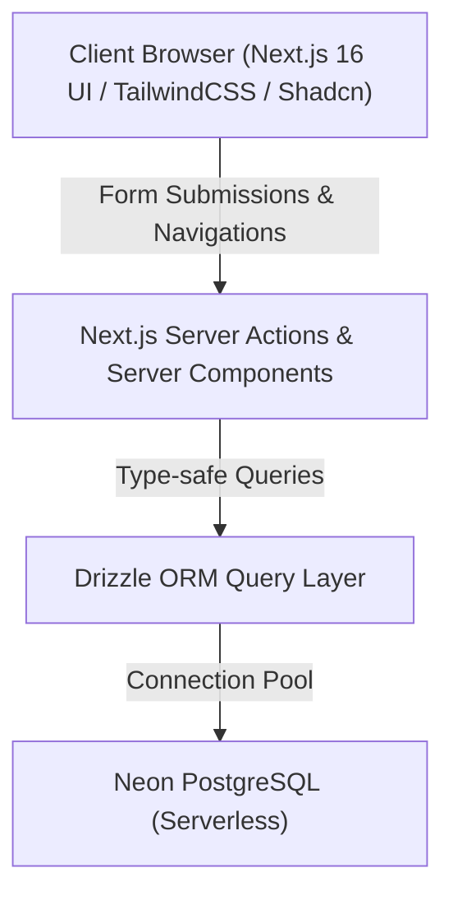

- **Framework**: Next.js 16 (App Router, Server Actions, Server Components)
- **Language**: TypeScript (Strict mode enabled, no `any`)
- **Database**: Serverless PostgreSQL via Neon DB
- **ORM**: Drizzle ORM (Type-safe schema, relational joins, migrations)
- **Styling & UI**: TailwindCSS v4, Shadcn UI / Radix primitives, Lucide React icons
- **Charts**: Recharts (Responsive bar and donut charts)
- **Validation**: Zod schema validation for all server actions

---

## 🗄️ Database Schema & ER Diagram

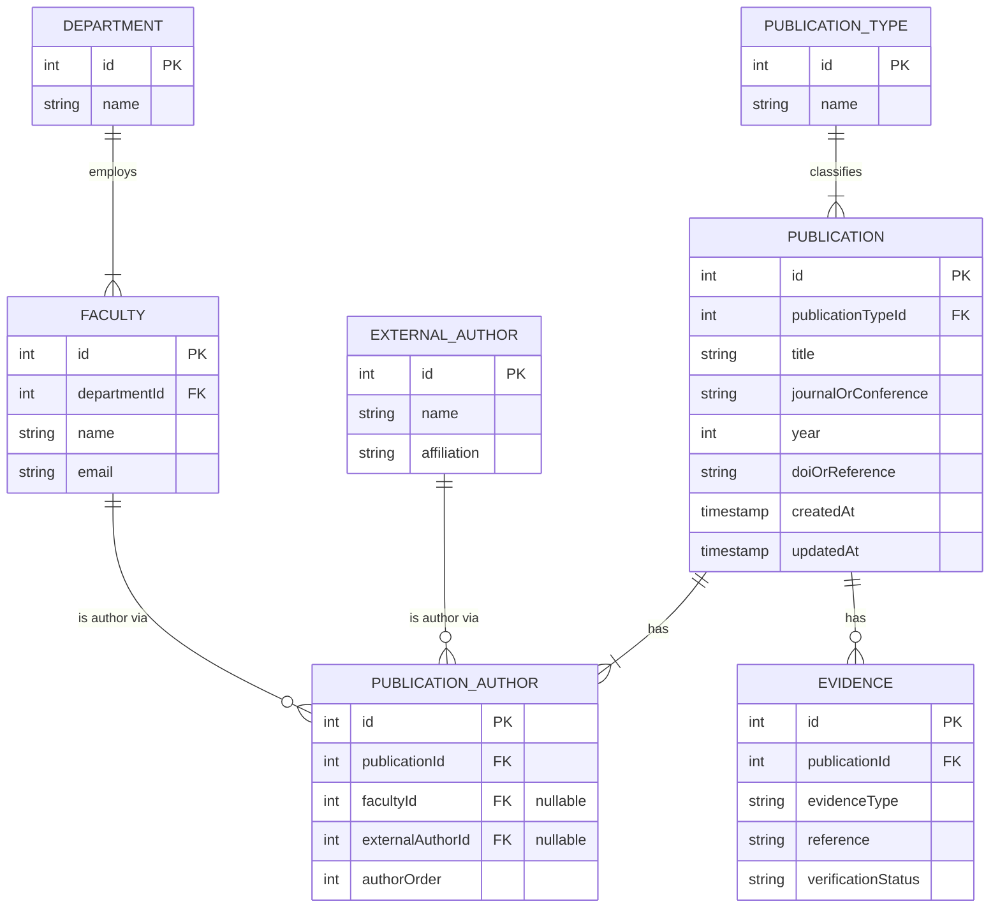

### Database Integrity Constraints
- `unique_pub_faculty`: Enforces that a faculty member cannot be added to the same publication more than once.
- `unique_pub_external_author`: Enforces that an external author cannot be added to the same publication more than once.
- `unique_pub_order`: Guarantees unique 1-based ordering per publication.
- `CASCADE DELETE`: Deleting a publication automatically purges its associated `publication_author` and `evidence` records.

---

## 🔄 User Navigation & System Flow

### Main Navigation Flow
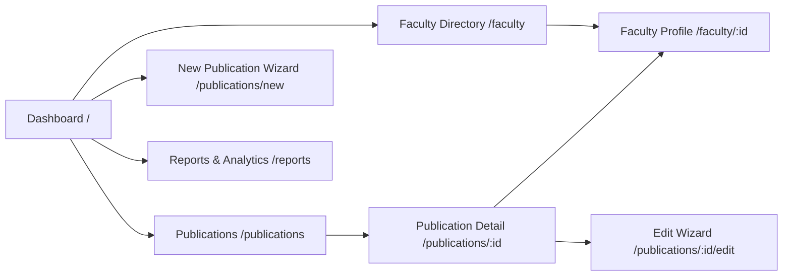

### Publication Creation 3-Step Wizard Flow
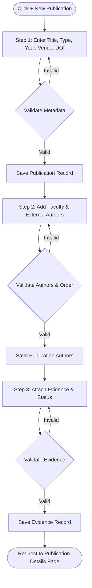

### Cascade Delete Flow
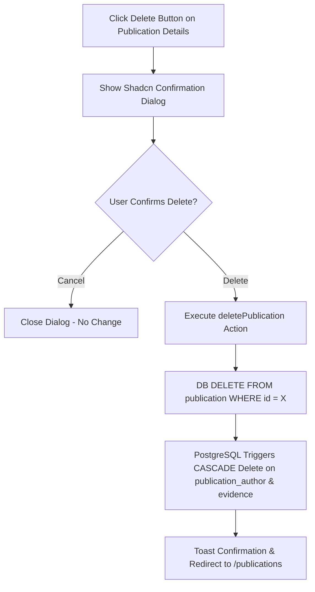

---

## 📱 Detailed Screen-by-Screen UI Documentation

### 1. Institutional Dashboard (`/`)
- **Purpose**: High-level overview of institutional research activity, accreditation readiness, and recent contributions.
- **User Role**: Admin, Faculty, Auditor.
- **UI Elements**: 4 KPI cards (Total Publications, Faculty Researchers, External Collaborators, Evidence Readiness segmented bar), Recent Contributions list, Publications by Year chart, Publication Type Donut chart, Department Breakdown bar chart.
- **Actions**: Navigation to Publication Creation Wizard via `+ New Publication` button, clicking recent publications to open detail views.
- **Data**: Aggregated counts and 5 newest publications sorted by ID DESC.

### 2. Publications Directory (`/publications`)
- **Purpose**: Searchable, filterable, and paginated directory of all institutional publications.
- **User Role**: All Users.
- **UI Elements**: Search input (Title/DOI), Filter dropdowns (Department, Type, Year, Evidence Status), Sort controls (Year/Title ASC/DESC), Publication rows with type badges and evidence badges, Pagination controls.
- **Actions**: Search by text, apply multi-criteria filters, toggle sorting, navigate pages, click row to open publication details.
- **Data**: Paginated list derived from server query `getPublicationsFiltered`.

### 3. Publication Creation / Edit Wizard (`/publications/new` & `/publications/:id/edit`)
- **Purpose**: Multi-step guided wizard for creating or updating a publication.
- **User Role**: Faculty / Research Administrators.
- **UI Elements**: Step progress indicator (Metadata → Authors → Evidence), Form controls, Command Popover for faculty search, Inline form for external author creation, Author list reordering controls, Evidence status selector.
- **Actions**: Enter publication details, select/create authors, reorder authors, attach evidence reference, submit form.
- **Data**: Inserts into `publication`, `external_author`, `publication_author`, and `evidence` tables.

### 4. Publication Details Page (`/publications/:id`)
- **Purpose**: Complete overview of a single publication record.
- **User Role**: All Users.
- **UI Elements**: Publication title, metadata card (Type, Year, Venue, DOI link), Ordered author list with distinct faculty (`⦿`) and external (`◇`) author badges, Evidence record card with verification status badge, Edit button, Delete button.
- **Actions**: Click faculty author name to navigate to their Research Profile, click DOI/Evidence link to open external URL, click Edit to reopen 3-step wizard, click Delete to trigger confirmation dialog.
- **Data**: Single publication record with joined `publicationAuthor`, `faculty`, `externalAuthor`, and `evidence` records.

### 5. Faculty Directory (`/faculty`)
- **Purpose**: Overview of all institutional faculty members.
- **User Role**: All Users.
- **UI Elements**: Search input, Faculty card grid/table showing name, email, department badge, and total publication count.
- **Actions**: Click faculty member card to view their Research Profile.
- **Data**: Faculty table records joined with department and publication author counts.

### 6. Faculty Research Profile (`/faculty/:id`)
- **Purpose**: Individual portfolio for a faculty researcher detailing output, active years, collaborators, and evidence readiness.
- **User Role**: Faculty, Department Chairs, Evaluators.
- **UI Elements**: Profile header (Name, Department, Email), 3 KPI cards (Total Publications, Active Years Range, External Collaborators Count), Evidence Verification Breakdown (segmented bar), Top Collaborators list, Chronological publications table.
- **Actions**: Click co-author links, view publication details, filter profile output.
- **Data**: Relational joins for specific `faculty_id` across `publication_author`, `publication`, `external_author`, and `evidence`.

### 7. Reports & Analytics (`/reports`)
- **Purpose**: Comprehensive institutional analytics and accreditation readiness report.
- **User Role**: Executive Leadership, Accreditation Evaluators, Department Heads.
- **UI Elements**: Publications by Year Bar Chart + dynamic trend insight, Publication Type Donut Chart + percentages, Department-wise Publications Bar Chart + top department insight, Faculty Publication Breakdown Table, Evidence Readiness Indicator, Cross-Department Collaborations Matrix.
- **Actions**: Review charts, click faculty profile links, inspect cross-department joint publication pairs.
- **Data**: Server-side SQL aggregate queries grouping by year, type, faculty, and department.

---

## ⚙️ Local Setup & Running Acceptance Tests

### Prerequisites
- Node.js 18+
- PostgreSQL database (or Neon serverless instance)

### Installation
```bash
# Install dependencies
npm install

# Run database migrations
npm run db:migrate

# Seed database with dummy dataset (15+ faculty, 25+ publications)
npm run db:seed

# Start development server
npm run dev
```

### Running E2E Acceptance Test Suite
The project includes a automated E2E acceptance test suite covering all 13 core requirements:

```bash
npx tsx scripts/e2e-test-suite.ts
```

Output:
```text
=== E2E ACCEPTANCE TEST RESULTS ===
✓ PASS: Publication appears in the Publications list
✓ PASS: Publication Details page shows all 3 authors in correct saved order
✓ PASS: Faculty A's Research Profile shows this publication
✓ PASS: Faculty B's Research Profile shows this publication
✓ PASS: The external author is visually and structurally distinct from the internal authors
✓ PASS: Publications-by-Year report count increased for 2026
✓ PASS: Faculty-wise report reflects the new publication for both Faculty A and Faculty B
✓ PASS: Department-wise report reflects the new publication for both departments involved
✓ PASS: Publication-type distribution reflects the new Journal publication
✓ PASS: Search finds the publication by title
✓ PASS: Filtering by year=2026 and type=Journal returns it
✓ PASS: Editing the publication (e.g. change the year) persists correctly and updates reports
✓ PASS: Deleting a separate test publication safely removes its publication_author and evidence rows (cascade), confirmed via a direct query, and does not affect any other publication

MVP ACCEPTANCE TEST PASSED — ready for optional differentiation work.
```
