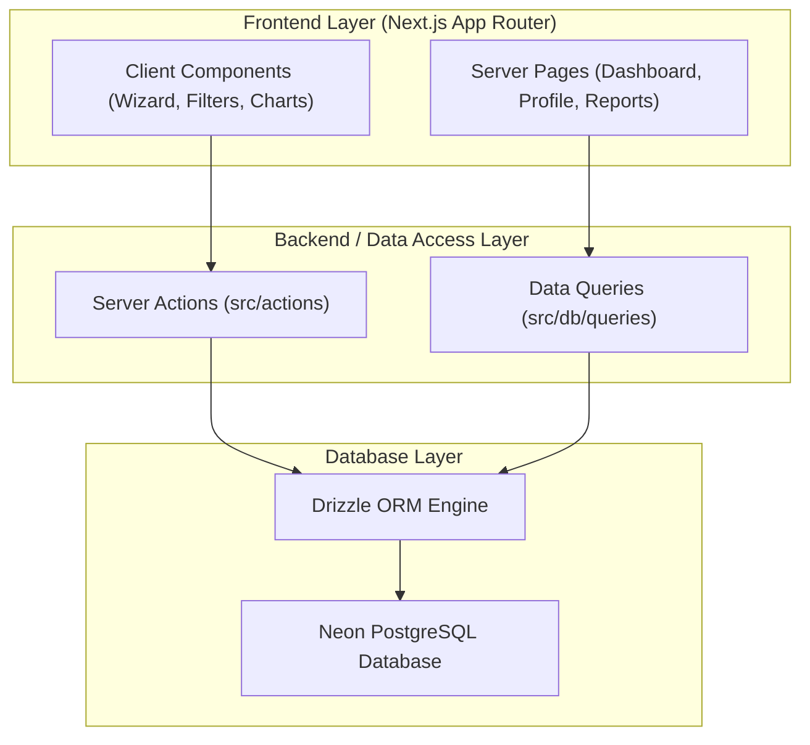

# Technical Architecture & Topology

## System Overview

Nexum is built using Next.js 16 App Router, utilizing Server Components for efficient server-side data fetching and Server Actions for mutation handling. The application interfaces with a Neon Serverless PostgreSQL database using Drizzle ORM.



---

## Technical Stack Specification

| Component | Technology | Description |
| :--- | :--- | :--- |
| **Framework** | Next.js 16 (Turbopack) | React 19 framework using App Router for server rendering and routing |
| **Language** | TypeScript 5 | Strict type safety enforced across UI components, Server Actions, and DB models |
| **Database** | Neon PostgreSQL | Cloud serverless PostgreSQL with connection pooling |
| **ORM** | Drizzle ORM 0.45 | Type-safe SQL builder and relational query provider |
| **Styling** | TailwindCSS v4 | Utility-first styling with modern design tokens and theme support |
| **UI Components** | Shadcn UI / Radix Primitives | Accessible UI primitives including Dialog, Select, Popover, Command, Table |
| **Visual Analytics** | Recharts 3 | Responsive SVG charting library for Bar and Pie/Donut distributions |
| **Form Validation** | Zod 4 | Schema validation for all Server Actions and client form steps |

---

## Directory Structure

```text
nexum/
├── docs/                      # Evaluator Documentation & Diagrams
│   ├── README.md
│   ├── architecture.md
│   ├── ui-flow.md
│   ├── er-diagram.md
│   ├── database.md
│   ├── features.md
│   └── screenshots/           # High-DPI UI Screenshots
├── scripts/                   # Automated E2E Test Suite & Utilities
│   └── e2e-test-suite.ts
├── src/
│   ├── actions/               # Next.js Server Actions (Mutations)
│   │   └── publications.ts
│   ├── app/                   # App Router Page Routes & Layouts
│   │   ├── page.tsx           # Institutional Dashboard
│   │   ├── publications/      # Publications Directory & Detail Page
│   │   ├── faculty/           # Faculty Directory & Research Profile Page
│   │   └── reports/           # Reports & Analytics Page
│   ├── components/            # Reusable UI & Feature Components
│   │   ├── dashboard/         # Dashboard KPI Cards & Recent Feed
│   │   ├── publications/      # Publication Table, Filters & 3-Step Wizard Forms
│   │   ├── reports/           # Analytics Charts & Matrices
│   │   └── ui/                # Shadcn UI primitives
│   ├── db/                    # Drizzle ORM Schema & Query Modules
│   │   ├── schema/            # 7 Core Postgres Table Definitions
│   │   ├── queries/           # Relational & Aggregate SQL Queries
│   │   └── seed/              # Database Seeder (15+ Faculty, 25+ Pubs)
│   └── lib/                   # Validation Schemas & Utilities
├── drizzle.config.ts          # Drizzle ORM Configuration
├── package.json
└── README.md                  # Project Root Readme
```
