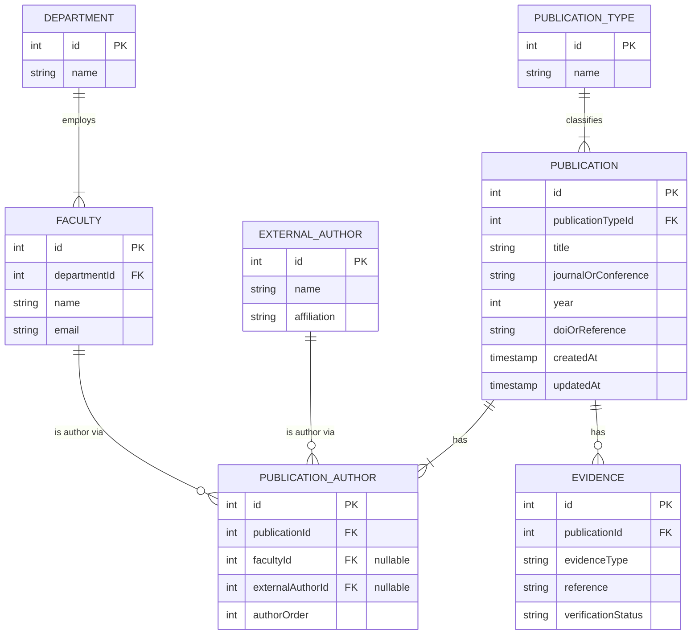

---

## Entity Descriptions & Key Relationships

### 1. `DEPARTMENT`
Represents an academic department (e.g. Computer Science, Electrical Engineering).
- `id` (Serial, Primary Key)
- `name` (Varchar(255), Not Null)

### 2. `FACULTY`
Represents an internal faculty member belonging to a department.
- `id` (Serial, Primary Key)
- `department_id` (Integer, Foreign Key → `department.id`)
- `name` (Varchar(255), Not Null)
- `email` (Varchar(255), Not Null)

### 3. `PUBLICATION_TYPE`
Represents standard categories of publication output (Journal, Conference, Patent, Project, Book Chapter).
- `id` (Serial, Primary Key)
- `name` (Varchar(100), Not Null)

### 4. `EXTERNAL_AUTHOR`
Represents non-faculty co-authors from external institutions or industry partners.
- `id` (Serial, Primary Key)
- `name` (Varchar(255), Not Null)
- `affiliation` (Varchar(255), Nullable)

### 5. `PUBLICATION`
Core publication record.
- `id` (Serial, Primary Key)
- `publication_type_id` (Integer, Foreign Key → `publication_type.id`)
- `title` (Varchar(500), Not Null)
- `journal_or_conference` (Varchar(255), Nullable)
- `year` (Integer, Not Null)
- `doi_or_reference` (Varchar(500), Nullable)
- `created_at`, `updated_at` (Timestamps)

### 6. `PUBLICATION_AUTHOR` (Junction Entity)
Tracks ordered co-authorship for both internal faculty (`faculty_id`) and external authors (`external_author_id`).
- `id` (Serial, Primary Key)
- `publication_id` (Integer, Foreign Key → `publication.id`, **ON DELETE CASCADE**)
- `faculty_id` (Integer, Nullable, Foreign Key → `faculty.id`)
- `external_author_id` (Integer, Nullable, Foreign Key → `external_author.id`)
- `author_order` (Integer, Not Null, 1-based order)
- **Constraints**:
  - `unique_pub_faculty`: `(publication_id, faculty_id)`
  - `unique_pub_external_author`: `(publication_id, external_author_id)`
  - `unique_pub_order`: `(publication_id, author_order)`

### 7. `EVIDENCE`
Verification document/link record associated with a publication.
- `id` (Serial, Primary Key)
- `publication_id` (Integer, Foreign Key → `publication.id`, **ON DELETE CASCADE**)
- `evidence_type` (Varchar(100), Not Null)
- `reference` (Varchar(500), Not Null)
- `verification_status` (Varchar(50), Default `'pending'`: `'verified' | 'pending' | 'missing'`)
