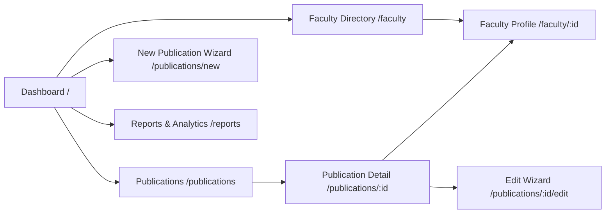

# UI Flow & User Journey Documentation

## System Navigation Overview

---

## 📱 Detailed Screen Documentation

### 1. Institutional Dashboard

#### Purpose
Provides high-level executive insights into institutional publication output, active faculty researchers, external collaboration, and accreditation readiness.

#### User
Institutional Leadership, Department Chairs, Evaluators.

#### UI Elements
- **Header**: Page title, description, and primary `+ New Publication` action button.
- **KPI Row**: 4 cards for Total Publications, Active Faculty Researchers, External Collaborators, and Evidence Readiness (with multi-segment progress bar).
- **Recent Contributions List**: Card rendering the 5 newest publications with first author, extra author badge (`+N`), publication type, and direct link.
- **Visual Analytics**: Interactive Bar Chart for Publications by Year, Donut Chart for Publication Type distribution, and Horizontal Bar Chart for Department Breakdown.

#### Actions
- Click `+ New Publication` to launch the 3-step creation wizard.
- Click any publication item to navigate to its Publication Details page.
- Hover over chart elements for dynamic tooltips and percentages.

#### Navigation
- `/` → `/publications/new`
- `/` → `/publications/:id`
- `/` → `/faculty/:id` (via faculty profile links in charts)

#### Data
- Aggregated SQL queries (`count`, `group by`) for metrics, plus limit 5 query for recent contributions.

---

### 2. Publications Directory

#### Purpose
Enables users to browse, search, filter, sort, and paginate through all recorded publications.

#### User
Faculty, Department Staff, Auditors.

#### UI Elements
- **Filter Bar**: Search input (Title/DOI), Department dropdown, Type dropdown, Year dropdown, Evidence Status dropdown, Sort By toggle (Year/Title), Sort Order toggle (ASC/DESC).
- **Active Filter Pills**: Displays active filter tags with clear options.
- **Publications Table**: Columns for Title, Type badge, Co-Authors summary (`⦿` Faculty vs `◇` External + count badge), Year, and Verification Status badge.
- **Pagination Controls**: Previous/Next buttons and page numbers.

#### Actions
- Type in search input to filter title or DOI in real time.
- Select dropdown options to apply multi-field filtering.
- Change page sizes or navigate pages.
- Click a publication row to view details.

#### Navigation
- `/publications` → `/publications/:id`
- `/publications` → `/publications/new`

#### Data
- Served via `getPublicationsFiltered` supporting server-side WHERE clauses and OFFSET/LIMIT pagination.

---

### 3. 3-Step Creation & Edit Wizard

#### Purpose
Guided workflow to input metadata, select/create co-authors in order, and attach evidence records.

#### User
Faculty Researchers, Administrative Staff.

#### UI Elements
- **Step Progress Header**: Visual indicator showing Step 1 (Metadata) → Step 2 (Authors) → Step 3 (Evidence).
- **Step 1 (Metadata)**: Inputs for Title, Type Select, Venue/Journal, Year, and DOI/Reference.
- **Step 2 (Authors)**: Internal Faculty Search Popover, Inline External Author Creator & Search, Author order list with glyphs (`⦿` for Faculty, `◇` for External), Remove author button, Up/Down reorder controls, Non-blocking hint if zero external authors.
- **Step 3 (Evidence)**: Evidence Type input, Reference URL/text input, Verification Status select (`Verified`, `Pending`, `Missing`), Save Publication button.

#### Actions
- Step 1: Input text and click `Next: Authors`.
- Step 2: Search faculty by name/department and click to add; or type new external author name + affiliation and click Add. Reorder authors via Up/Down buttons. Click `Next: Evidence`.
- Step 3: Input evidence reference and click `Save Publication`.

#### Navigation
- `/publications/new` → `/publications/new/:id/authors` → `/publications/new/:id/evidence` → `/publications/:id`
- `/publications/:id/edit` → `/publications/:id/edit/authors` → `/publications/:id/edit/evidence` → `/publications/:id`

#### Data
- Executes `createPublicationStep1`, `savePublicationAuthors`, and `createPublicationEvidence` Server Actions.

---

### 4. Publication Details Page

#### Purpose
Displays the full authoritative record for a single publication, including co-authors and evidence.

#### User
All Users, Evaluators.

#### UI Elements
- **Header**: Publication title, Type badge, Year, Venue.
- **Metadata Card**: DOI/Reference link, creation timestamp.
- **Author List**: Ordered list of co-authors displaying `⦿` for internal faculty (with department badge and profile link) and `◇` for external authors (with affiliation badge).
- **Evidence Card**: Evidence reference, type, and verification status badge (`Verified`, `Pending`, `Missing`).
- **Action Buttons**: `Edit` button (re-opens wizard pre-filled) and `Delete` button (opens Shadcn Dialog).
- **Delete Confirmation Dialog**: Modal explaining that deleting will cascade delete all linked `publication_author` and `evidence` records.

#### Actions
- Click faculty name to view profile.
- Click DOI link to open reference.
- Click Edit to modify record.
- Click Delete, confirm in dialog to purge record.

#### Navigation
- `/publications/:id` → `/publications/:id/edit`
- `/publications/:id` → `/faculty/:id`
- `/publications/:id` → `/publications` (after delete)

---

### 5. Faculty Directory & Research Profile

#### Purpose
Profiles each faculty member's individual research portfolio, active years, top collaborators, and evidence readiness.

#### User
Faculty, Evaluators, Department Heads.

#### UI Elements
- **Directory (`/faculty`)**: Grid of faculty cards displaying name, email, department badge, and publication count.
- **Profile (`/faculty/:id`)**: Header with department & email, 3 KPI cards (Total Publications, Active Years Range, External Collaborator Count), Evidence Verification Breakdown (segmented bar), Top Collaborators section ranking co-authors by joint output, and Chronological publication history table.

#### Actions
- Click faculty card in directory to open profile.
- Click co-author links in Top Collaborators list.
- Click publication titles to open details page.

#### Navigation
- `/faculty` → `/faculty/:id`
- `/faculty/:id` → `/publications/:id`

---

### 6. Reports & Analytics Page

#### Purpose
Provides institutional-level research output reports, department comparisons, publication type breakdowns, evidence readiness indicators, and cross-department collaboration matrices.

#### User
Executive Leadership, Accreditation Evaluators.

#### UI Elements
- **Publications by Year**: Bar Chart + dynamic trend insight line.
- **Publication Type Distribution**: Donut Chart + percentages & top type insight line.
- **Department-wise Publications**: Horizontal Bar Chart + top department insight line.
- **Faculty Publication Breakdown**: Ranked table of faculty by publication volume.
- **Evidence Readiness Indicator**: Readiness % badge + segmented status bar (Verified/Pending/Missing).
- **Cross-Department Collaborations**: Matrix of inter-departmental co-authorship pairs.

#### Actions
- Hover over charts for tooltips.
- Click faculty names in breakdown table to view profiles.

#### Navigation
- `/reports` → `/faculty/:id`
- `/reports` → `/publications`
